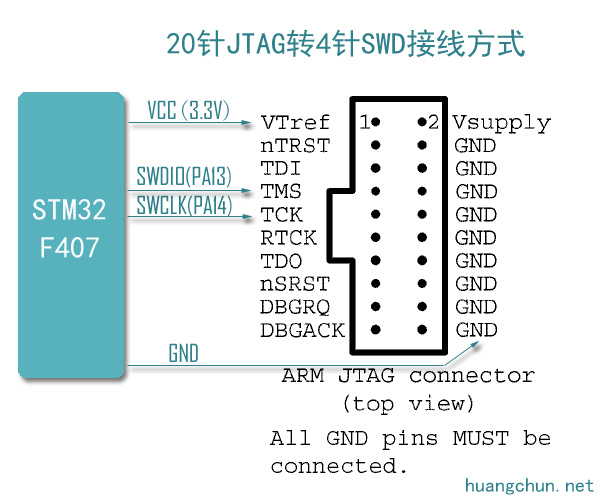

# STM32F103xx
基于STM32F103C8T6（ARM Cortex-M3内核）开发的项目，开发工具为keil uvision5和vs2017.
>STM32F103C8T6是一款集成电路，芯体尺寸为32位，程序存储器容量是64KB，需要电压2V~3.6V，工作温度为-40°C ~ 85°C。
## 项目结构
### USER
* **test.c** -主文件
### SYSTEM
|文件夹|功能|
|---|:---|
|**delay**|     延时函数文件|
|**sys**|       系统定义及基本功能函数文件|
|**usart**| 串口调试函数文件|
### HARDWARE
文件夹|功能
---|:---
**ADC** | 电池电压检测（PA4）
**CONTROL** | 中断控制文件
**DataScope_DP** | MiniBalance上位机通讯
**DHT11** | 温湿度模块（数据口-PB12）
**DMP** | MPU6050 DMP文件
**ENCODER** | 编码功能相关文件(TIM2-(PA0，PA1).TIM3-(PA6,PA7))
**EXTI** | 外部中断控制文件（PB3）
**filter** | 滤波文件
**HC_SR04** | HC_SR04超声波测距（ECHO-PB0，TRIG-PB1）
**IIC**| IIC相关文件（PB10，PB11）
**KEY**| 按键控制文件（PA15）
**LED**| LED控制文件（PA8）
**MOTIR** | 电机接口初始化（PB8，PB9）
**MPU6050**| MPU6050控制文件
**OLED** | OLED显示(B12,B13,C14,C15)
**show** | OLED显示，app发送数据，上位机显示
**STMFLASH** | FLASH操作
**TIMER** | 定时器初始化
**USART2** | USART2模块(PA2，PA3)
### OBJ
None

## Others
* **串口2**---PA2，PA3
* **串口1**---PA9，PA10
* **SWD调试接口**---PA13,PA14

版权所有Copyright © 2017 by SoyM

All rights reserved。