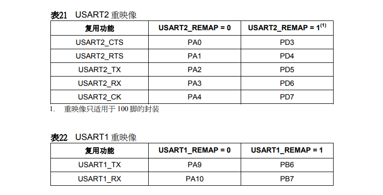

# STM32F103xx
基于STM32F103C8T6（ARM Cortex-M3内核）开发的项目，开发工具为keil uvision5和vs2017.
>STM32F103C8T6是一款集成电路，芯体尺寸为32位，程序存储器容量是64KB，需要电压2V~3.6V，工作温度为-40°C ~ 85°C。

## 项目结构
### USER
* **test.c** -主文件
### SYSTEM
|文件夹|功能|
|---|:---|
|**delay**|     延时函数文件|
|**sys**|       系统定义及基本功能函数文件|
|**usart**| 串口调试函数文件|
### HARDWARE
文件夹|功能
---|:---
**ADC** | 电池电压检测（PA4）
**CONTROL** | 中断控制文件
**DataScope_DP** | MiniBalance上位机通讯
**DHT11** | 温湿度模块（数据口-PB12）
**DMP** | MPU6050 DMP文件
**ENCODER** | 编码功能相关文件(TIM2-(PA0，PA1).TIM3-(PA6,PA7))
**EXTI** | 外部中断控制文件（PB3）
**filter** | 滤波文件
**HC_SR04** | HC_SR04超声波测距（ECHO-PB0，TRIG-PB1）
**IIC**| IIC相关文件（PB10，PB11）
**KEY**| 按键控制文件（PA15）
**LED**| LED控制文件（PA8）
**MOTIR** | 电机接口初始化（PB8，PB9）
**MPU6050**| MPU6050控制文件
**OLED** | OLED显示(B12,B13,C14,C15)
**RFID** | 非接触式读写卡芯片(未完成)
**show** | OLED显示，app发送数据，上位机显示
**STMFLASH** | FLASH操作
**TCS3200** | 颜色识别模块
**TIMER** | 定时器初始化
**USART2** | USART2模块(PA2，PA3)
### OBJ
None

## MARK
**复用功能** | TIM4_REMAP=0 | TIM4_REMAP=1
---|:---:|:---:
TIME4_CH1 | PB6 | PD12
TIME4_CH2 | PB7 | PD13
TIME4_CH3 | PB8 | PD14
TIME4_CH4 | PB9 | PD15

**复用功能** | TIM3_REMAP[1:0]=00 | TIM3_REMAP[1:0]=10 | TIM3_REMAP[1:0]=11
---|:---:|:---:|:---:
TIME3_CH1 | PA6 | PB4 | PC6
TIME3_CH2 | PA7 | PB5 | PC7
TIME3_CH3 | PB0 | PB0 | PC8
TIME3_CH4 | PB1 | PB1 | PC9

**复用功能** | TIM2_REMAP[1:0]=00 | TIM2_REMAP[1:0]=01 | TIM2_REMAP[1:0]=10 | TIM2_REMAP[1:0]=11
---|:---:|:---:|:---:|:---:
TIME2_CH1/ETR | PA0 | PA15 | PA0 | PA15
TIME2_CH2 | PA1 | PB3 | PA1 | PB3
TIME2_CH3 | PA2 | PA2 | PB10 | PB10
TIME2_CH4 | PA3 | PA3 | PB11 | PB11

**复用功能** | TIM1_REMAP[1:0]=00 | TIM1_REMAP[1:0]=01 | TIM1_REMAP[1:0]=11
---|:---:|:---:|:---:
TIME1_ETR | PA12 | PA12 | PE7
TIME1_CH1 | PA8 | PA8 | PE9
TIME1_CH2 | PA9 | PA9 | PE11
TIME1_CH3 | PA10 | PA10 | PE13
TIME1_CH4 | PA11 | PA11 | PE14
TIM1_BKIN | PB12 | PA6 | PE15
TIM1_CH1N | PB13 | PA7 | PE8
TIM1_CH2N | PB14 | PB0 | PE10
TIM1_CH3N | PB15 | PB1 | PE12

版权所有Copyright © 2017 by SoyM

All rights reserved。